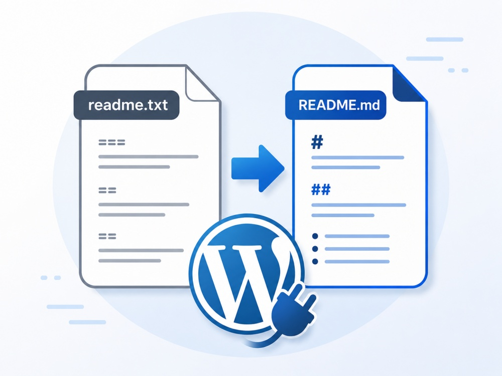

# wp-plugin-readme2md

<p align="center">
  
</p>


A GitHub Action that converts WordPress plugin `readme.txt` files into GitHub Markdown. Generate clean `README.md` files automatically as part of your workflow.

This is useful for plugin developers who maintain a WordPress.org-style readme but also want a clean and up-to-date README on GitHub without maintaining two separate files.

## Features

- Converts WordPress.org plugin readme format to GitHub Markdown
- Preserves headings, lists, links, and code blocks
- Automatically converts WordPress.org screenshots into GitHub-friendly image references
- Detects and displays plugin banners when available
- Generates a clean `README.md`
- Perfect for keeping WordPress.org and GitHub documentation in sync

## Usage

```yaml
- name: Convert readme.txt to README.md
  uses: pushpasta/wp-plugin-readme2md@v1
```

### Inputs

| Input | Description | Default | Valid Values |
|-------|-------------|---------|--------------|
| `include` | Comma-separated list of dynamic badges to include. Order controls badge placement. | `''` | `stars`, `forks`, `watchers`, `last-commit`, `downloads` |
| `badge-style` | Shield style for dynamic badges | `flat` | `flat`, `flat-square`, `plastic`, `for-the-badge`, `social` |

Dynamic badges require repository context, resolved from `GITHUB_REPOSITORY` in GitHub Actions or from `git remote` locally.

```yaml
- name: Convert readme.txt to README.md
  uses: pushpasta/wp-plugin-readme2md@v1
  with:
    include: stars, forks, last-commit
    badge-style: flat
```

## Example Workflow

For a complete example, see [`workflow.yml`](workflow.yml).

## Requirements

- A WordPress-style `readme.txt` file in your repository.
- The action generates or updates `README.md` in the repository root.

## License

MIT
